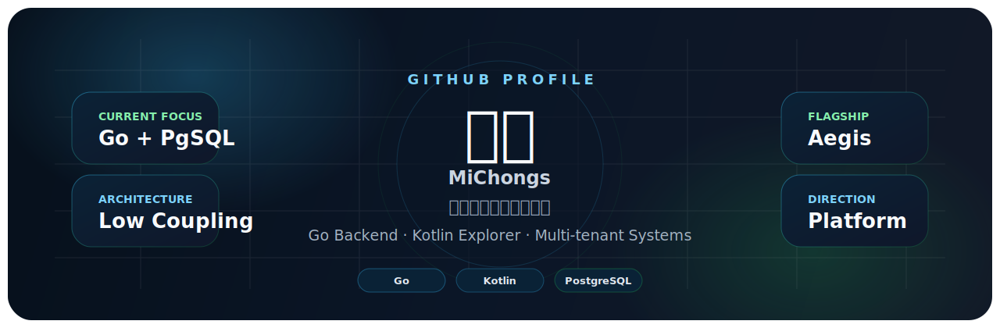

  

  

  
  
  
  

<h2 align="center">About Me</h2>

  我是川意，聚焦于后端工程、平台架构与多应用系统设计。 
  当前主要围绕 Go、Gin、PostgreSQL、Redis、NATS 与 Temporal 构建高性能服务。 
  同时持续关注 Kotlin、Android 工具链与面向开发者的产品实践。

<h2 align="center">Tech Stack</h2>

  

  
  
  
  
  
  

<h2 align="center">Selected Projects</h2>

  
  

  

<table align="center">
  <tr>
    <th>Project</th>
    <th>Summary</th>
    <th>Stack</th>
  </tr>
  <tr>
    <td><a href="https://github.com/MiChongs/aegis">aegis</a></td>
    <td>面向高并发与低耦合设计的多租户用户平台</td>
    <td>Go, Gin, PostgreSQL, Redis, NATS, Temporal</td>
  </tr>
  <tr>
    <td><a href="https://github.com/MiChongs/user_system">user_system</a></td>
    <td>用户系统与认证架构方向的持续实践</td>
    <td>Node.js, Express, MySQL, Redis</td>
  </tr>
  <tr>
    <td><a href="https://github.com/MiChongs/Leaf-IDE">Leaf-IDE</a></td>
    <td>面向 Android 的现代 IDE 项目探索</td>
    <td>Kotlin, Android</td>
  </tr>
</table>

<h2 align="center">GitHub Analytics</h2>

  
  

  

  

  

<h2 align="center">Links</h2>

  

  Focused on performance, modularity, and maintainable engineering systems.

  

